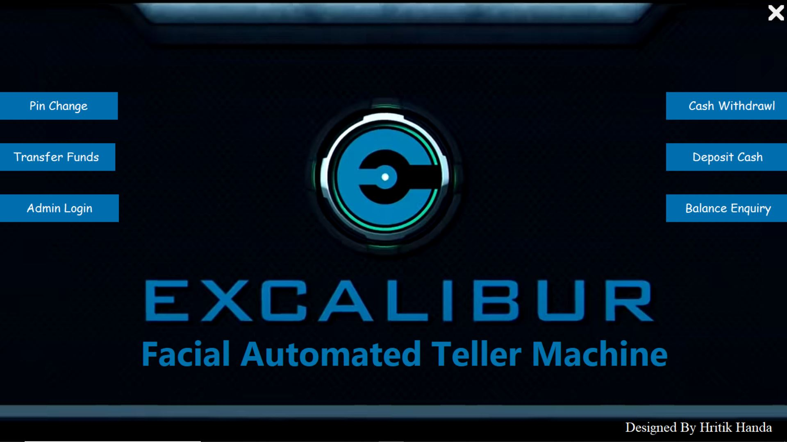
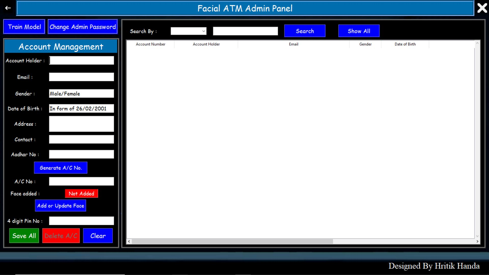

# Facial-Automated-Teller-Machine-ATM-

<h3>Introduction:</h3>

Facial Automated Teller Machine (ATM) is a enchanced version of ATM machines which utilizes Human Biometric (Facial Features) to find the User Account without any card or account number requirement.

<h3>Features:</h3>
<ul>
  <li>System will search for account using Face recognition and transaction will be verified using ATM Pin.</li>
  <li>No need to remember Long Account numbers</li>
  <li>No debit or credit card required</li>
  <li>Fast and Secure</li>
</ul>

<h3>Technology used:</h3>
<ul> 
  <li>Front-End:  Tkinter</li>
   <li>Back-End: Python Basic</li>
  <li>Database: MySQL</li>
  <li>Model: LBPH Face Recognizer from opencv</li>
</ul>

<h3>Some screenshots:</h3>
<h5>Main Panel</h5>

<h5>Admin Panel</h5>

<h6>For full working and info : <a href="https://github.com/hritikhanda4/Facial-Automated-Teller-Machine-ATM-/screenshots/video.mp4">Refer to Video by clicking here</a></h6>
